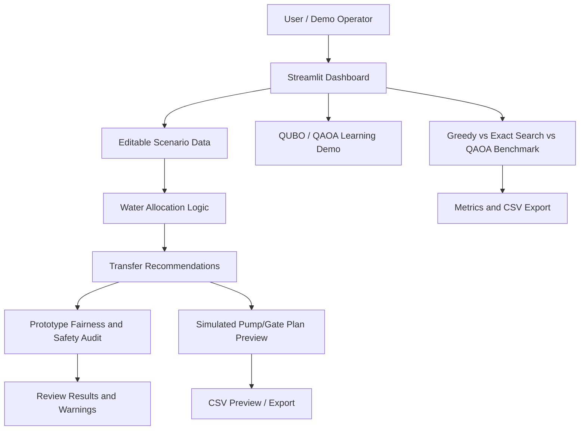
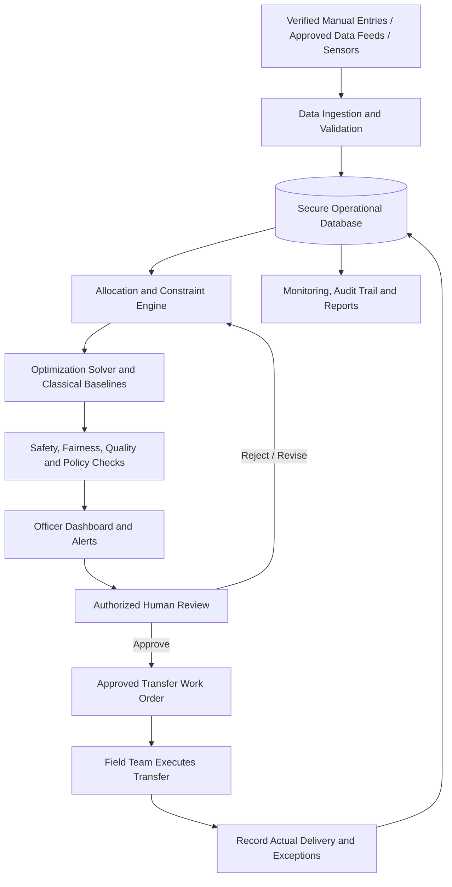

# 💧 Water Rescue Exchange

**Smarter Water Distribution • Stronger Communities • A Safer Tomorrow**

Water Rescue Exchange is a hackathon prototype for **water-allocation decision support**. It uses supply and demand information to suggest possible transfers from areas with surplus water to areas facing shortages. It also contains educational QUBO/QAOA examples, a classical-versus-QAOA benchmark, and a fairness-aware drought scenario lab with an independent hard-constraint audit.

> **Current status:** This is a prototype using editable/demo data. It does not ingest verified live sensor data, certify water allocations, or control physical pumps and gates. Recommendations require human review.

[](https://github.com/elitecoder2366/water-rescue-exchange)
[](https://water-rescue-exchange-cqti59sqcvw7zyto6fa65h.streamlit.app/)
[](https://www.python.org/)
[](https://www.ibm.com/quantum/qiskit)

## 📌 Problem Statement

Water scarcity and uneven distribution can create serious challenges. One location may have available water while another faces a shortage, but deciding where, when, and how much water to transfer can involve competing needs, deadlines, route capacities, permissions, and operational risks.

Water Rescue Exchange explores a data-driven way to help water managers review available information and compare potential transfer plans. It is a decision-support tool, not an autonomous authority for allocating water.

## 💡 Our Solution

- **Water allocation dashboard:** Review and edit illustrative supply and demand data.
- **Transfer recommendations:** Suggest potential transfers from surplus areas to shortage areas using prototype allocation logic.
- **QUBO/QAOA learning demos:** Explore a simplified optimization formulation and QAOA using Qiskit's local simulator.
- **Classical baseline comparison:** Compare a greedy baseline, exact classical search, and QAOA simulation on the same small illustrative benchmark.
- **Fairness and safety review:** Inspect basic authorization, deadline, cumulative donor-surplus, recipient-need, and recipient satisfaction-gap checks.
- **Simulated pump/gate plan:** Preview and export proposed transfer actions without sending commands to equipment.
- **Scenario testing:** Change example supply, demand, urgency, travel-time, and deadline values.
- **CSV exports:** Save supported results for further review.

## 🏗️ Full Solution Architecture

### Current prototype architecture

The following describes the application as it exists today. It is not a claim that every future production component has already been built.



**Current data flow:**

1. A user reviews or edits the example water supply, demand, urgency, and route-related fields available in the app.
2. The allocation logic proposes candidate transfers according to its implemented prototype rules.
3. The app presents recommendations and a basic audit to help identify selected allocation issues.
4. The user can inspect a simulated pump/gate action plan and export supported results.
5. The separate optimization benchmark compares three methods on a small toy problem; it does not replace or validate the full allocation workflow.\n6. The scenario lab scales demo surplus down and unmet demand up to represent drought stress, then compares exact classical enumeration with QAOA simulation on a small candidate set. It reports a simple recipient satisfaction gap and independently rejects QAOA selections that violate modeled hard constraints.\n7. An optional IBM Quantum Runtime account check can report whether credentials/backends are discoverable. The current app does not submit quantum jobs; it always executes the scenario using the local simulator.

### Proposed real-world architecture

This is the recommended evolution path, not functionality currently claimed by this repository.



**Recommended production components:**

- **Data sources:** Begin with verified manual entries; later evaluate approved APIs, telemetry, tank-level sensors, and flow meters.
- **Validation layer:** Check units, timestamps, missing or stale readings, impossible values, duplicate records, and source reliability.
- **Operational database:** Store locations, tanks, water availability, demand, routes, capacity, water quality, constraints, users, approvals, and transfer history.
- **Decision engine:** Apply explicit hard constraints and documented priorities before recommending a feasible plan.
- **Optimization layer:** Use validated classical optimization as a baseline. Evaluate QAOA only where it is useful and fairly comparable; it is not required for a useful product.
- **Safety and policy layer:** Validate water quality, legal permissions/water rights, hydraulic feasibility, deadlines, capacity, emergency priorities, and allocation policy with domain experts.
- **Human approval:** Authorized staff review, edit, approve, or reject recommendations. Keep a record of the decision and reason.
- **Execution and feedback:** Initially provide work orders for field staff. Record actual volumes, timestamps, and exceptions to improve subsequent decisions.
- **Monitoring and security:** Use role-based access, audit logs, backups, alerting, data retention rules, incident handling, and cybersecurity review.

Real equipment integration is a separate engineering project. Any future pump/gate interface would require validated control requirements, fail-safe behavior, manual override, field testing, and authorization before connection to operational equipment.

## 🔄 Example End-to-End Workflow

1. **Enter the situation:** Record a location's available water, current demand, and time of last update.
2. **Describe transfer options:** Provide verified routes and capacities when known.
3. **Generate recommendations:** The system proposes candidate transfers based on the current prototype logic.
4. **Review warnings:** Check donor surplus, recipient need, authorization, deadlines, and any other validated constraints available in the system.
5. **Approve outside the prototype:** A qualified and authorized person independently verifies any real transfer decision.
6. **Record outcomes:** In a future operational version, compare planned and actual delivery and log any exception.

## ✨ Key Features

### 💧 Water Allocation Dashboard

Review supply and demand values and inspect suggested water transfers. Current scenarios are illustrative and should not be treated as live operational data.

### ⚛️ QUBO and QAOA Demos

QUBO is a way to express a simplified optimization problem. The QAOA demo uses Qiskit to simulate a small quantum circuit locally while a classical optimizer adjusts its parameters. The educational QUBO demonstration and the QAOA benchmark are not a production-grade water-distribution solver.

- **Simulator only:** No physical quantum computer is used.
- **Simplified formulation:** Real allocation requires richer data and validated constraints.
- **No quantum advantage claim:** QAOA is not claimed to be faster or better than classical methods in this project.

### ⚛️ Combined Quantum Allocation, Fairness & Drought Scenario Lab\n\nThe new scenario lab uses the currently edited demo fields to create a small set of candidate donor-to-recipient transfers. A drought slider reduces listed donor surplus and increases recipient need. It compares exact classical enumeration with a QAOA statevector simulation using an objective that rewards urgency-weighted delivery and includes a soft penalty for recipient satisfaction imbalance.\n\n- **Hard constraints are rechecked independently:** donor capacity and recipient need are validated after optimization; invalid QAOA selections are not displayed as approved transfers.\n- **Fairness is only a proxy:** the satisfaction gap is not a guarantee of equitable distribution and the soft objective penalty cannot replace policy or human review.\n- **Bounded demo size:** candidate options are capped to keep statevector simulation tractable. Results are illustrative, not operational advice.\n- **Hardware discovery, not hardware execution:** the optional IBM Quantum Runtime check reports whether credentials and operational backends are available. The current scenario run does not submit a physical quantum job. Simulator fallback is always available.\n\n### 📊 Classical vs QAOA Comparison

The small benchmark compares greedy selection, exact classical search, and QAOA statevector simulation using the same toy objective and capacity limits. Results include objective value, water moved, feasibility, selected transfers, and a single measured runtime. A CSV export is available.

Exact classical search is the reference optimum for this small instance. QAOA is approximate and may not match it. A single small simulation runtime is illustrative, not a general performance benchmark.

### 🛡️ Fairness & Safety Review

The prototype audit checks basic issues such as authorization, deadlines, cumulative transfers exceeding a donor's listed surplus, and transfers exceeding a recipient's remaining listed need. It also reports a simple recipient need-satisfaction gap.

These checks are limited indicators. They do not guarantee fairness or validate water rights, water quality, hydraulic conditions, infrastructure safety, or local policy.

### 🚰 Simulated Pump / Gate Control Preview

Generate and export a preview plan for proposed transfers. It is **simulation only**: the app sends no commands and has no connection to physical pumps, irrigation gates, PLCs, or IoT equipment.

## 🧭 Real-World Product Roadmap

### Phase 1 — Reliable MVP with manual data

- Select one initial customer/use case, such as a campus, apartment complex, irrigation group, or local water-management team.
- Define units, data fields, update frequency, and who is authorized to edit or approve them.
- Add secure authentication, role-based access, persistent storage, input validation, and audit history.
- Test recommendations on realistic, reviewed scenarios and compare them with expert decisions.

### Phase 2 — Pilot and operational validation

- Work with water-management and engineering experts to document the actual allocation rules.
- Validate hydraulic feasibility, route constraints, water quality, permissions, emergency priority, and measurement uncertainty.
- Run in **shadow mode**: produce recommendations without directing real operations, then compare against actual decisions and outcomes.
- Track useful measures such as unmet demand, delivery reliability, losses, fairness indicators, and operator overrides.

### Phase 3 — Verified data integration

- Integrate approved data feeds or sensors only after checking their reliability, calibration, timestamps, and failure modes.
- Add stale-data warnings, missing-data handling, anomaly detection, and monitoring.
- Keep a manual fallback for outages and incorrect readings.

### Phase 4 — Controlled field workflow

- Provide approved work orders to field teams and record completed volumes and exceptions.
- Define escalation, manual override, incident response, and rollback procedures.
- Consider equipment connectivity only after a separate safety, cybersecurity, and field-engineering review.

### Phase 5 — Scale responsibly

- Evaluate reliability across seasons, locations, and demand conditions.
- Improve reporting, localization, accessibility, support, backups, and disaster recovery.
- Compare optimization methods on representative workloads; retain the simplest method that meets operational needs.

## 🧰 Tech Stack

- Python
- Streamlit
- Pandas
- Qiskit
- SciPy
- NumPy
- Pytest

## 🚀 Live Demo

Try the deployed prototype:

**https://water-rescue-exchange-cqti59sqcvw7zyto6fa65h.streamlit.app/**

## 🛠️ Run Locally

### 1. Clone the repository

```bash
git clone https://github.com/elitecoder2366/water-rescue-exchange.git
cd water-rescue-exchange
```

### 2. (Recommended) Create a virtual environment

```bash
python -m venv .venv
```

Activate it on Windows:

```powershell
.venv\Scripts\Activate.ps1
```

Or on macOS/Linux:

```bash
source .venv/bin/activate
```

### 3. Install dependencies

```bash
pip install -r requirements.txt
```

### 4. Start the app

```bash
streamlit run app.py
```

Streamlit will print a local URL in your terminal; open it in your browser.

## 📁 Project Structure

```text
water-rescue-exchange/
├── app.py                       # Main Streamlit application and dashboard
├── requirements.txt             # Python dependencies
├── runtime.txt                  # Python runtime version for deployment
├── src/
│   ├── water_rescue.py           # Water-allocation logic and prototype audit
│   ├── quantum_optimizer.py      # QAOA demo using Qiskit simulator
│   └── optimization_benchmark.py # Classical baselines vs QAOA comparison
├── tests/
│   └── test_water_rescue.py      # Tests for allocation logic
└── README.md                     # Project documentation and architecture
```

## 🧪 Testing

Run the available tests with:

```bash
pytest
```

Review test results and try several scenarios manually. Passing tests do not by themselves establish that the system is safe for real water operations.

## 🛡️ Safety, Fairness & Responsible Use

This is an educational and hackathon prototype, not a production emergency-response system. Its checks are not production-grade safety or fairness guarantees. It does not currently provide verified live data ingestion, a secure multi-user operational workflow, validated hydraulic modeling, regulatory approval, or real equipment control.

Before real-world use, involve qualified water-management, hydraulic, safety, cybersecurity, and local policy experts. Validate recommendations against real conditions and maintain human authorization and an independent safe operating procedure.

## 🌍 Future Improvements

- Secure users, roles, and persistent operational data.
- Add verified live data feeds, maps, and route/hydraulic constraints.
- Expand fairness, emergency priority, water quality, authorization, and policy checks with expert review.
- Add historical reporting, alerts, planned-versus-actual delivery tracking, and audit trails.
- Pilot in shadow mode before relying on recommendations.
- Evaluate QAOA on suitable benchmark problems without assuming quantum advantage.
- Explore equipment integration only after separate safety and cybersecurity validation.

## 👥 Project

**Repository:** https://github.com/elitecoder2366/water-rescue-exchange  
**Live app:** https://water-rescue-exchange-cqti59sqcvw7zyto6fa65h.streamlit.app/

---

**💙 Save Water • Save Lives**
